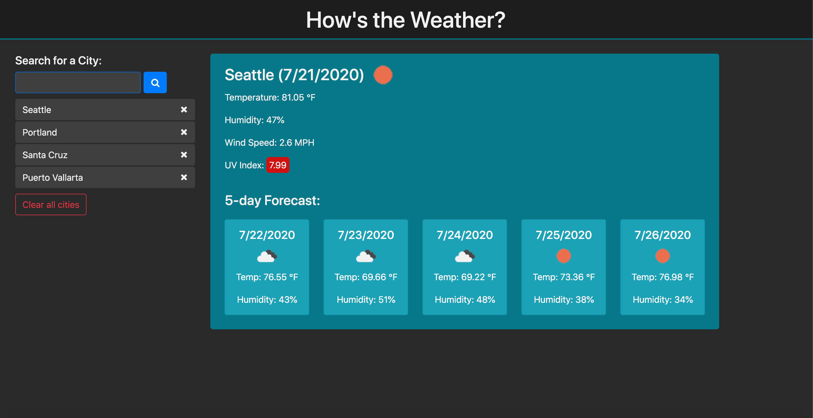

# hows-the-weather

## Overview

How's the Weather is a weather dashboard application with search functionality to find current weather conditions and the future weather outlook for user-selected cities.

## Features

* Uses the [OpenWeather API](https://openweathermap.org/api) to retrieve weather data for cities.

* Uses AJAX to hook into the API to retrieve data in JSON format.

* Runs in the browser featuring dynamically updated HTML and CSS powered by jQuery.

* Includes a search history so that users can access their past search terms.

* Search history stored in local storage and persists upon page reload.

* Clicking on the dynamically created city button performs a new search that returns current and future conditions for that city.

* Ability to clear all or selected city buttons from page and local storage.

* Displays the following under current weather conditions:

  - City

  - Date

  - Icon image (visual representation of weather conditions)

  - Temperature

  - Humidity

  - Wind speed

  - UV index

* Includes a 5-Day Forecast which displays the following:

  - Date

  - Icon image (visual representation of weather conditions)

  - Temperature

  - Humidity

## Preview

## Github Link

[How's the Weather](https://sheplt1.github.io/hows-the-weather/)